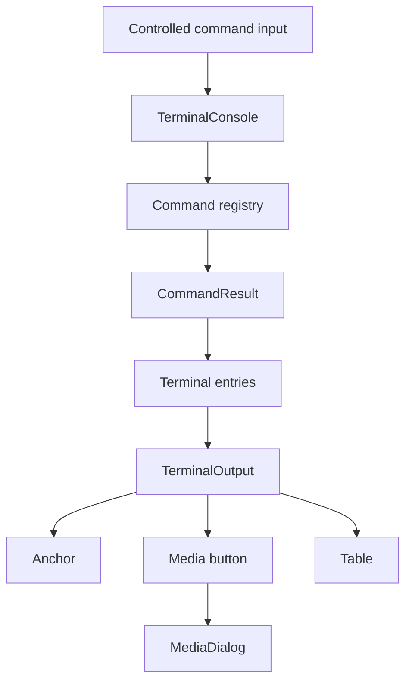

# Custom React Terminal Component — Solution Design

## 1. Summary

The website will replace `react-console-emulator` with a small, application-specific React terminal component.

The component is not intended to emulate a real TTY, execute shell programs, or provide a reusable public library. It only needs to:

- accept a known set of website commands;
- show command suggestions and command history;
- render trusted, structured website content;
- support keyboard-accessible links and media dialogs;
- render paragraphs, preformatted text, and fixed-width tables;
- preserve the existing visual terminal style.

The runtime implementation uses standard React state and semantic DOM elements. Static content is authored in a deliberately restricted Markdown dialect and compiled to the terminal AST before Next.js runs, so no Markdown parser or raw HTML renderer is shipped to the browser.

## 2. Goals

The first implementation must support:

1. Command input with suggestions.
2. Text output.
3. Terminal and content styling.
4. Links that can be reached and activated with the keyboard.
5. Structured content:
   - links;
   - image triggers that open a dialog;
   - video triggers that open a dialog;
   - tables with optional borders and column widths expressed in characters;
   - paragraph alignment.

The solution should be easy to understand and change by a single maintainer.

## 3. Non-goals

The following are deliberately outside the first version:

- POSIX shell compatibility;
- a virtual file system;
- ANSI/VT escape-sequence parsing;
- quoted or escaped shell arguments;
- command pipelines and redirection;
- streaming command output;
- persistent command history;
- dynamically installed commands or plugins;
- user-authored or untrusted HTML;
- a general-purpose or runtime Markdown implementation;
- exact terminal-cell width calculation for emoji, combining characters, or full-width CJK characters;
- multiple terminal instances on the same page.

These can be added later only if a concrete website requirement appears.

## 4. Main design decisions

### 4.1 Use a controlled React input

The command input will be a normal controlled `<input>` owned by React. This gives direct access to its value and keyboard events without querying or modifying another library's internal DOM.

### 4.2 Keep commands in a local registry

Commands will be declared in a local `Record<string, CommandDefinition>`. This is enough for dispatch, `help`, and suggestions. There is no separate registration API.

### 4.3 Return structured output instead of HTML

Command handlers will return a small `TerminalBlock[]` model. React will render these blocks using normal JSX. This avoids `dangerouslySetInnerHTML`, DOM post-processing, and lifecycle problems caused by replacing text nodes after render.

### 4.4 Keep media dialogs outside terminal output

An image or video in terminal content will render as a text-like button. Activating it sets `activeMedia` in the terminal component. A single shared `MediaDialog` renders above the terminal.

### 4.5 Prefer semantic HTML

Links will be real anchors, media triggers will be buttons, tables will use table markup, and output will be exposed as a live log. Native browser keyboard behavior will provide most accessibility behavior without a custom focus system.

### 4.6 Compile Markdown at build time

Trusted `.md` files are parsed by a deterministic build-time compiler. The compiler accepts only the terminal-specific Markdown subset, validates directives and URLs with source-positioned errors, and emits a tracked typed TypeScript module. Runtime commands continue returning `TerminalBlock[]` directly.

## 5. Proposed structure

```text
web/src/components/terminal/
  TerminalConsole.tsx        Terminal state, command execution, input, history
  TerminalOutput.tsx         Structured block and inline-content renderer
  MediaDialog.tsx            Shared image/video dialog
  commands.ts                Website command registry
  terminal.types.ts          Command and output types
  TerminalConsole.module.css Terminal-specific styles

web/src/content/
  markdown/                  Authoritative main, about, and CV Markdown
  generated/terminalContent.ts Tracked generated TerminalBlock arrays
  terminalMarkdown.ts        Restricted Markdown-to-terminal compiler
  main.ts, about.ts, cv.ts    Stable re-export modules

web/scripts/
  compile-terminal-content.ts Deterministic content generation
  dev.ts                      Markdown watcher plus Next.js development server
```

The exact number of files may be reduced during implementation if a file remains very small. The important boundary is that command execution and output rendering do not depend on DOM post-processing.

## 6. Component architecture



### `TerminalConsole`

Responsibilities:

- own the input value;
- derive command suggestions;
- handle Enter, Tab, ArrowUp, ArrowDown, and Escape;
- execute commands;
- store rendered command entries;
- keep focus on the input after command execution;
- auto-scroll after new output;
- own the currently opened media item.

It should not contain formatting-specific rendering logic.

### `TerminalOutput`

Responsibilities:

- render every `TerminalBlock` variant;
- render inline text, links, and media triggers;
- call `onOpenMedia(media)` when a media trigger is activated;
- apply paragraph alignment and table column widths.

It should be a pure component with no terminal history or command knowledge.

### `MediaDialog`

Responsibilities:

- use a native `<dialog>` where browser support permits;
- render either an `` or `<video controls>`;
- close on Escape, close-button activation, or backdrop activation;
- provide a dialog label;
- restore focus to the triggering media button after closing.

Only one dialog instance is needed for the entire terminal.

### Command registry

Responsibilities:

- map command names to descriptions and handlers;
- provide command names for suggestions;
- provide metadata for the `help` command;
- return output data rather than mutating terminal state.

## 7. Data model

The initial model should stay intentionally small.

```ts
type ParagraphAlignment = 'left' | 'center' | 'right' | 'justify';
type TerminalColor =
  | 'black' | 'blue' | 'green' | 'cyan' | 'red' | 'magenta' | 'brown'
  | 'light-gray' | 'dark-gray' | 'light-blue' | 'light-green'
  | 'light-cyan' | 'light-red' | 'light-magenta' | 'yellow' | 'white';

type InlineContent =
  | string
  | {
      type: 'link';
      label: string;
      href: string;
      newTab?: boolean;
    }
  | {
      type: 'media';
      mediaType: 'image' | 'video';
      label: string;
      src: string;
      description: string;
    }
  | {
      type: 'color';
      color: TerminalColor;
      content: InlineContent[];
    };

type TerminalBlock = { color?: TerminalColor } & (
  | {
      type: 'blank';
    }
  | {
      type: 'paragraph';
      content: InlineContent[];
      align?: ParagraphAlignment;
    }
  | {
      type: 'pre';
      text: string;
    }
  | {
      type: 'table';
      bordered?: boolean;
      columns: Array<{
        width: number;
        align?: 'left' | 'center' | 'right';
      }>;
      rows: string[][];
    }
);

type CommandResult =
  | { type: 'output'; blocks: TerminalBlock[] }
  | { type: 'clear' };

type CommandDefinition = {
  description: string;
  usage?: string;
  execute: (args: string[]) => CommandResult | Promise<CommandResult>;
};

type TerminalEntry = {
  id: number;
  command: string | null;
  output: TerminalBlock[];
};
```

The model does not expose arbitrary class names, inline styles, HTML, or React nodes. New variants should be introduced only when real content cannot be expressed by the existing variants.

## 8. State model

`TerminalConsole` requires only the following state:

```ts
type TerminalState = {
  input: string;
  entries: TerminalEntry[];
  commandHistory: string[];
  historyIndex: number | null;
  activeMedia: MediaContent | null;
  isExecuting: boolean;
};
```

Suggestions should be derived from `input` and the command registry instead of stored separately. A `useRef` counter can generate entry IDs. A second ref can remember the draft input while the user browses command history.

Regular `useState` is sufficient. A reducer is not necessary for the first version.

## 9. Command execution flow

1. The user submits the form or presses Enter.
2. The input is trimmed.
3. The first whitespace-separated token is treated as the command name.
4. Remaining tokens are passed as `args`.
5. The raw command is appended to command history.
6. The matching handler is executed.
7. An output result creates a new `TerminalEntry` containing the command echo and blocks.
8. A clear result removes existing entries.
9. A missing command or thrown error is converted into a standard error paragraph.
10. The input is cleared, focused, and scrolled into view.

Only one command will execute at a time. The input will be disabled while an asynchronous command is running.

The MVP parser intentionally uses whitespace splitting. Quoted arguments are not required by current website commands.

## 10. Requirement implementation

### 10.1 Command input with suggestions

Suggestions will use command names from the registry.

Behavior:

- suggestions are shown only while the user is editing the first command token;
- matching is case-insensitive and prefix-based;
- at most a small fixed number of matches is displayed;
- Tab accepts the first matching suggestion;
- Enter executes the current input;
- ArrowUp and ArrowDown navigate previously executed commands;
- Escape clears the current suggestion display without clearing the input.

The suggestion display is informational rather than a general autocomplete widget. It is rendered as a text-only box-drawing popup, positioned above and aligned with the command input. The popup overlays existing terminal output instead of changing layout. Argument suggestions and fuzzy matching are excluded from the MVP.

The input will have an associated visible or visually hidden label. Suggestion changes will be exposed through a polite status region, but keyboard focus will remain in the input.

### 10.2 Text output

Two block types cover text output:

- `paragraph` for wrapping prose and inline interactive elements;
- `pre` for ASCII art, manually formatted CV sections, and text where whitespace must be preserved.

Command errors are rendered as paragraph blocks using `color: 'light-red'`.

### 10.3 Styling

Styling will remain in a CSS module and reuse the website's existing CSS variables where possible.

The solution needs styles for:

- terminal root and scroll viewport;
- output log;
- command echo and prompt;
- input row;
- suggestion text;
- paragraphs and preformatted blocks;
- links and media buttons;
- bordered and borderless tables;
- dialog, image, and video;
- focus-visible states;
- reduced-motion behavior.

No theme prop or external styling API is needed. The existing CRT effects can remain outside or around the new terminal component.

### 10.4 Links and keyboard navigation

Links will render as `<a href="...">` elements.

- Tab and Shift+Tab move through links in normal DOM order.
- Enter activates a focused link.
- External links opened in a new tab use `rel="noopener noreferrer"`.
- A visible `:focus-visible` style is mandatory.

No custom arrow-key navigation between output links is needed. Native browser link navigation satisfies the keyboard-navigation requirement with less code and more predictable accessibility.

Media triggers are actions rather than navigation, so they will render as `<button type="button">` styled to look like terminal links. Buttons support both Enter and Space natively.

### 10.5 Images and video

Images and videos appear in text as media triggers. Activating a trigger opens the shared dialog.

Image dialog behavior:

- render an `` with the supplied description as `alt` text;
- constrain the image to the viewport while preserving its aspect ratio.

Video dialog behavior:

- render `<video controls preload="metadata">`;
- do not autoplay;
- pause the video when the dialog closes.

Sources are trusted local assets or explicitly configured remote URLs. Uploads and arbitrary user URLs are outside the MVP.

### 10.6 Tables

Borderless tables use visible semantic `<table>`, `<colgroup>`, `<tr>`, and `<td>` elements. Bordered tables render a DOS-style visual representation with Unicode box-drawing characters while retaining a visually hidden semantic table for assistive technology.

Each column specifies its content width as a positive integer or `*`. The renderer converts fixed widths to CSS `ch` units, for example `width: 24ch`. A single `*` column expands to the remaining terminal width and is recalculated when the terminal is resized. The terminal uses a monospace font, so this provides the expected character-based layout for the website's Latin and Cyrillic content.

Behavior:

- `bordered: true` renders borders with `┌─┬─┐`, `│`, `├─┼─┤`, and `└─┴─┘` characters;
- `bordered: false` removes borders while preserving column alignment;
- cells support the same inline color directives as paragraphs, including nested colors;
- borderless cells may also contain links and media actions; bordered cells are limited to text and inline colors so the DOS character grid remains accessible and deterministic;
- cell alignment comes from the column definition;
- content longer than the configured width wraps;
- at most one flexible `*` column is allowed;
- the page keeps a single vertical scroll context; tables do not create their own horizontal scroll container.

Exact Unicode terminal-cell measurement is deliberately excluded. If it later becomes necessary, the table renderer can adopt a `string-width`-style measurement without changing the content model.

### 10.7 Paragraph alignment

Paragraph blocks map `align` directly to CSS `text-align`.

- missing alignment defaults to `left`;
- `center`, `right`, and `justify` are supported;
- preformatted blocks are always left-aligned and preserve whitespace.

## 11. Accessibility

The minimal accessibility contract is:

- wrap output in `role="log"` with `aria-live="polite"` and `aria-relevant="additions"`;
- keep a programmatic label on the command input;
- keep focus in the input after command submission;
- use native anchors and buttons for interactive output;
- provide visible focus indicators;
- use a labelled dialog with a keyboard-accessible close button;
- restore focus after closing media;
- hide purely decorative CRT layers and ASCII decoration from assistive technology when appropriate;
- respect `prefers-reduced-motion` for overlay and CRT animations.

The terminal should not use `role="application"`; native document and form semantics are sufficient and produce more predictable screen-reader behavior.

## 12. Content authoring

Static content lives under `src/content/markdown`. Standard paragraphs, links, image syntax, fenced `text` blocks, and GFM tables cover common content. Image syntax produces a text-like media action; known video extensions select the video dialog automatically. The custom directives add terminal-specific capabilities that ordinary Markdown cannot express.

The leaf directive `::blank` inserts exactly one empty terminal row. It is used for intentional spacing without reintroducing browser paragraph margins or changing the terminal's line-height rhythm.

The compiler rejects headings, lists, emphasis, raw HTML, inline code, unsafe URL schemes, malformed table metadata, and other unsupported nodes with file and line information. Generated TypeScript is committed, but it is never edited manually. `build`, `test`, and `lint` regenerate it first; `dev` watches Markdown and relies on Next HMR after regeneration.

## 13. Error handling

The controller will normalize errors into terminal output:

- unknown command: `Command '<name>' not found. Type 'help' to list commands.`;
- thrown `Error`: show a short generic message in production and optionally log the original error to the browser console;
- rejected command promise: treat it like a thrown error;
- invalid table data: fail fast during development and avoid rendering malformed rows.

No error boundary specific to each output block is needed initially. The application's existing error boundary remains the last-resort fallback.

## 14. Testing strategy

The first version should have focused tests rather than broad snapshot coverage.

Unit tests:

- command parsing;
- prefix suggestion selection;
- command-history navigation;
- command registry and `help` output;
- clear-result handling;
- table validation.
- Markdown parsing and directive validation;
- media type detection and unsafe URL rejection;
- deterministic code generation and migrated-content coverage.

Component interaction tests:

- Enter executes a command and renders output;
- Tab completes a suggested command;
- ArrowUp and ArrowDown recall history;
- links are reachable and have the expected destination;
- image and video triggers open the correct dialog;
- Escape closes the dialog and restores focus;
- bordered and borderless tables receive the correct styles.

A production build remains the final integration check.

## 15. Migration plan

1. Add terminal types and the structured output renderer.
2. Add the controlled terminal input, command dispatch, history, and suggestions.
3. Add the shared media dialog, tables, alignment, and CRT styling.
4. Add the restricted Markdown compiler and custom directives.
5. Migrate main, about, and CV content to `.md` files.
6. Add deterministic generation and development watching.
7. Add parser, renderer, interaction, and generation tests.
8. Remove `react-console-emulator`, its type shim, `contentParser`, and `linkOverlayBinder` after feature parity is verified.

The old and new terminals do not need to coexist in production. During implementation, the new component can be developed behind a local import switch until it reaches parity.

## 16. Acceptance criteria

The custom component is complete for the first version when:

- `help`, `about`, `cv`, and `clear` work without `react-console-emulator`;
- command suggestions appear and Tab completes a command;
- command history works with ArrowUp and ArrowDown;
- plain and preformatted text render correctly;
- links are reachable with Tab and activatable with Enter;
- image and video triggers open an accessible dialog;
- bordered and borderless tables honor configured `ch` column widths and a single flexible `*` column;
- paragraph alignment works for all supported values;
- the existing terminal visual style is preserved;
- no output rendering uses raw HTML or post-render DOM mutation;
- the obsolete terminal dependency and adapter utilities are removed.
